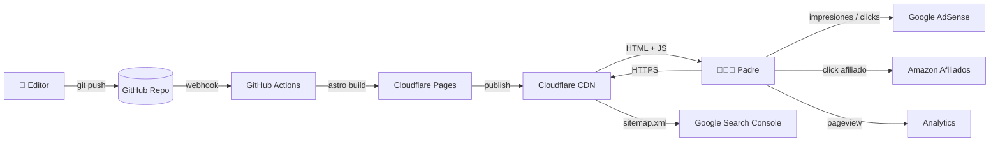

# Arquitectura — Web Fútbol para Niños

> Documento vivo. Cualquier cambio estructural debe registrarse como ADR al final.

---

## 1. Contexto y requisitos

**Producto:** Sitio de contenido SEO para padres con hijos de 4–12 años sobre fútbol infantil. Contenido evergreen + estacional (Mundial, LaLiga).

**Modelo de negocio:** AdSense (CPC) + Amazon Afiliados (balones, conos, equipación) + recursos descargables PDF (futuro lead-magnet → email → infoproductos).

**Volumen esperado (12 meses):**
- 30–80 artículos publicados
- 5k–50k visitas/mes (objetivo año 1: 30k)
- 95% tráfico orgánico desde Google
- 80% tráfico móvil

**Equipo:** 1 desarrollador + Claude Code. Sin DevOps dedicado.

**Restricciones críticas:**
- Coste mensual < 5 USD (hosting + dominio)
- Core Web Vitals "Good" (LCP < 2.5s, CLS < 0.1, INP < 200ms) — requisito AdSense + SEO
- Build < 60s para iterar rápido
- Contenido editable sin tocar código

---

## 2. Patrón arquitectónico: Static Site + Content Collections

**Decisión:** Sitio estático generado en build-time desde colecciones Markdown/MDX. Sin backend propio, sin base de datos, sin runtime de servidor.

**Por qué:**
- SEO máximo — HTML pre-renderizado, indexable al 100%
- Performance imbatible — assets servidos desde CDN, sub-segundo TTFB
- Coste casi cero — Cloudflare Pages free tier cubre 30k visitas/mes sin problema
- Cero superficie de ataque — no hay servidor que mantener
- Editable por humanos — Markdown es portable y resistente al tiempo

**Por qué NO microservicios / SSR / WordPress:**
- WordPress: hosting >$5/mes, plugins frágiles, performance pobre por defecto, vulnerabilidades constantes, build lento para iterar
- Next.js SSR: overkill para contenido estático, cold starts en serverless, más complejo de cachear
- CMS headless (Sanity, Strapi): añade dependencia + coste + capa de complejidad sin beneficio para 30 artículos

---

## 3. Stack técnico

| Capa | Elección | Justificación |
|------|----------|---------------|
| **Framework** | Astro 5.x | Static-first, zero-JS por defecto, content collections nativas, image optimization built-in, MDX, sitemap, RSS — todo sin plugins externos |
| **Estilos** | Tailwind CSS 4 + @tailwindcss/typography | Tokens semánticos vía CSS vars, JIT, prose para artículos largos |
| **Lenguaje** | TypeScript strict | Type-safe content schemas (Zod), evita errores en frontmatter |
| **Contenido** | Markdown + MDX en `src/content/` | Versionado en git, editable en VS Code, portable a cualquier framework futuro |
| **Imágenes** | Astro Image (`<Image />`) + Sharp | WebP/AVIF automático, responsive srcset, lazy loading, evita CLS |
| **Iconos** | Lucide (astro-icon) | SVG inline, tree-shaking, consistente |
| **Búsqueda** | Pagefind | Indexa en build, runtime cliente puro, 0 backend, < 30KB |
| **Analytics** | Cloudflare Web Analytics + GA4 | CWA gratis y privacy-first; GA4 para AdSense/AdSense linking |
| **Monetización** | AdSense (Auto Ads + slots manuales) + Amazon OneLink | Slots manuales en posiciones planificadas (ver §6) |
| **Hosting** | Cloudflare Pages | Free tier ilimitado (500 builds/mes), CDN global, HTTPS auto, edge cache, preview deploys por PR |
| **CI/CD** | GitHub Actions + Cloudflare Pages Git integration | PR preview automático, deploy a producción al merge en `main` |
| **Dominio** | Hostinger (ya contratado) o Cloudflare Registrar | Apuntar NS a Cloudflare |
| **SEO tooling** | Google Search Console + Ahrefs Webmaster Tools (free) + Bing Webmaster | GSC obligatorio; Ahrefs free para backlinks |

---

## 4. Diagrama del sistema



---

## 5. Estructura de carpetas

```
webfutbolninos/
├── .github/
│   └── workflows/
│       ├── ci.yml                    # lint + typecheck + build en PR
│       └── lighthouse.yml            # CWV check post-deploy
├── docs/                             # Documentación (este folder)
│   ├── Arquitectura.md
│   ├── DisenoUI.md
│   ├── MarcaPosicionamiento.md
│   ├── PlanTrabajo.md
│   └── FlujoTrabajo.md
├── public/
│   ├── favicon.svg
│   ├── robots.txt
│   ├── _headers                      # Cabeceras Cloudflare (cache, CSP)
│   └── recursos/                     # PDFs descargables servidos directos
├── src/
│   ├── assets/                       # Imágenes que pasan por Astro Image
│   │   ├── articulos/
│   │   ├── categorias/
│   │   └── brand/
│   ├── components/
│   │   ├── article/                  # ArticleCard, ArticleHero, ArticleMeta, TOC
│   │   ├── ads/                      # AdSlot, InArticleAd, NewsletterCTA
│   │   ├── affiliate/                # AmazonCard, ProductGrid, ComparisonTable
│   │   ├── layout/                   # Header, Footer, Container, MobileNav
│   │   ├── seo/                      # SEOHead, JsonLd, Breadcrumb, OgImage
│   │   ├── ui/                       # Button, Badge, Tag, Pill, Icon
│   │   └── widgets/                  # Search, Newsletter, RelatedArticles
│   ├── content/
│   │   ├── config.ts                 # Schemas Zod de todas las collections
│   │   ├── articulos/                # 1 .mdx por artículo
│   │   │   ├── ejercicios/
│   │   │   ├── juegos/
│   │   │   ├── mundial/
│   │   │   ├── laliga/
│   │   │   └── beneficios/
│   │   ├── categorias/               # Metadata de cada categoría
│   │   ├── recursos/                 # Frontmatter de PDFs descargables
│   │   └── autores/
│   ├── layouts/
│   │   ├── BaseLayout.astro          # <html>, head SEO, GA, AdSense script
│   │   ├── ArticleLayout.astro       # Hero + prose + sidebar + ads
│   │   ├── CategoryLayout.astro
│   │   └── ResourceLayout.astro
│   ├── lib/
│   │   ├── seo.ts                    # Helpers JSON-LD, OG, canonical
│   │   ├── content.ts                # getCollection wrappers, related posts
│   │   ├── slugify.ts
│   │   └── analytics.ts              # Eventos GA4 + AdSense tracking
│   ├── pages/
│   │   ├── index.astro               # Home
│   │   ├── 404.astro
│   │   ├── sobre-nosotros.astro
│   │   ├── politica-privacidad.astro # Obligatoria AdSense
│   │   ├── politica-cookies.astro
│   │   ├── aviso-legal.astro
│   │   ├── contacto.astro
│   │   ├── buscar.astro              # Pagefind UI
│   │   ├── rss.xml.ts                # Feed RSS dinámico
│   │   ├── sitemap-index.xml         # Generado por @astrojs/sitemap
│   │   ├── og/[...slug].png.ts       # OG images dinámicas (Satori)
│   │   ├── [categoria]/
│   │   │   ├── index.astro           # Listado de categoría
│   │   │   └── [slug].astro          # Artículo
│   │   └── recursos/
│   │       ├── index.astro
│   │       └── [slug].astro
│   ├── styles/
│   │   ├── global.css                # Tailwind + tokens CSS vars
│   │   └── prose.css                 # Override prose para artículos
│   └── consts.ts                     # SITE_URL, autor, redes, etc.
├── astro.config.mjs
├── tailwind.config.ts
├── tsconfig.json                     # strict: true, paths @/
├── package.json
├── .env.example                      # GA_ID, ADSENSE_ID, AMAZON_TAG
├── .gitignore
├── CLAUDE.md
└── README.md
```

---

## 6. Content Collections (schemas)

```typescript
// src/content/config.ts
import { defineCollection, z, reference } from 'astro:content';

const articulos = defineCollection({
  type: 'content',
  schema: ({ image }) => z.object({
    title: z.string().max(70),                    // SEO title
    description: z.string().min(120).max(160),    // Meta description
    slug: z.string().optional(),
    publishedAt: z.date(),
    updatedAt: z.date().optional(),
    autor: reference('autores'),
    categoria: reference('categorias'),
    tags: z.array(z.string()).default([]),
    cover: image(),
    coverAlt: z.string(),
    edadMin: z.number().min(4).max(12),           // Filtro UX clave
    edadMax: z.number().min(4).max(12),
    duracion: z.number().optional(),              // minutos del ejercicio/juego
    dificultad: z.enum(['facil', 'media', 'dificil']).optional(),
    materiales: z.array(z.string()).optional(),
    productosAfiliados: z.array(reference('productos')).optional(),
    recursoDescargable: reference('recursos').optional(),
    relatedSlugs: z.array(z.string()).optional(),
    draft: z.boolean().default(false),
    featured: z.boolean().default(false),
    keyword: z.string(),                          // Keyword principal
    secondaryKeywords: z.array(z.string()).default([]),
  }),
});

const categorias = defineCollection({
  type: 'data',
  schema: ({ image }) => z.object({
    nombre: z.string(),
    slug: z.string(),
    descripcion: z.string(),
    descripcionLarga: z.string(),                 // Para SEO landing
    color: z.enum(['verde', 'azul', 'naranja', 'rojo', 'amarillo']),
    icono: z.string(),                            // nombre lucide-icon
    cover: image(),
    orden: z.number(),
  }),
});

const recursos = defineCollection({
  type: 'data',
  schema: ({ image }) => z.object({
    titulo: z.string(),
    descripcion: z.string(),
    slug: z.string(),
    pdf: z.string(),                              // ruta en /public/recursos/
    preview: image(),
    paginas: z.number(),
    edadMin: z.number(),
    edadMax: z.number(),
    requiresEmail: z.boolean().default(false),    // Para fase lead-magnet
  }),
});

const autores = defineCollection({
  type: 'data',
  schema: ({ image }) => z.object({
    nombre: z.string(),
    bio: z.string(),
    avatar: image(),
    redes: z.object({ twitter: z.string().optional(), linkedin: z.string().optional() }).optional(),
  }),
});

export const collections = { articulos, categorias, recursos, autores };
```

---

## 7. Estrategia de imágenes

- **Formato:** Astro `<Image />` genera AVIF + WebP + fallback JPG, con `<picture>` y `srcset` automático.
- **Tamaños:** 400w, 800w, 1200w, 1920w. Sizes calculados según breakpoint del componente.
- **Lazy:** `loading="lazy"` excepto cover de hero (preload + fetchpriority="high").
- **Dimensiones obligatorias:** width + height en frontmatter o componente para evitar CLS.
- **Origen:** Imágenes propias en `src/assets/`. Para imágenes externas (raras, p.ej. Mundial) → almacenar copia local con licencia documentada en frontmatter.
- **Alt text:** Obligatorio en schema. Bloqueo en build si falta.
- **OG images:** Generadas en build con `@vercel/og` (Satori) usando template propio (logo + título + categoría). Endpoint `/og/[slug].png`.

---

## 8. SEO técnico (no negociable)

- `<title>` único por página, < 60 chars.
- `<meta description>` 120–160 chars, único.
- Canonical URL en cada página.
- Open Graph + Twitter Card completos.
- JSON-LD por tipo:
  - Home: `WebSite` + `SearchAction`
  - Categoría: `CollectionPage` + `BreadcrumbList`
  - Artículo: `Article` + `BreadcrumbList` + `Person` (autor)
  - Recurso: `HowTo` o `CreativeWork` según tipo
- `sitemap-index.xml` particionado: artículos, categorías, recursos.
- `robots.txt` permitiendo todo, con sitemap declarado.
- RSS feed `/rss.xml` con últimos 50 artículos.
- Hreflang `es-ES` por defecto (preparar `es-MX`, `es-AR` para fase 2).
- Internal linking: componente `<RelatedArticles>` automático por tags + categoría compartida.
- Breadcrumbs visibles + estructurados en cada artículo y categoría.
- URLs limpias: `/ejercicios/conduccion-balon-6-anos` (no `/blog/post/...`).

---

## 9. Monetización — slots planificados

**Política:** Densidad publicitaria moderada para no romper UX ni violar políticas AdSense. Máximo 3 ads por artículo + 1 sticky footer mobile (opcional A/B test).

**Posiciones por layout:**

| Página | Slot | Tipo | Componente |
|--------|------|------|------------|
| Home | Hero bottom | Display 728x90 / responsive | `<AdSlot id="home-hero" />` |
| Home | Entre secciones (1) | In-feed nativo | `<AdSlot id="home-feed" />` |
| Categoría | Header bottom | Display responsive | `<AdSlot id="cat-top" />` |
| Categoría | Cada 6 artículos | In-feed | Lógica en `CategoryLayout` |
| Artículo | Después del intro (post H1) | In-article responsive | `<InArticleAd position="top" />` |
| Artículo | Mid-content (post 50% scroll o tras H2 #2) | In-article | `<InArticleAd position="mid" />` |
| Artículo | Antes de "Artículos relacionados" | Display | `<InArticleAd position="bottom" />` |
| Sidebar (desktop) | Sticky | Display 300x600 | `<StickyAd />` |

**Afiliados Amazon:**
- Componente `<AmazonCard asin="..." />` lazy + click tracking GA4
- `<ComparisonTable products={[...]} />` para guías "mejor balón fútbol niños"
- Disclaimer obligatorio al inicio de artículo con afiliados (componente `<AffiliateDisclosure />`)
- Tag `?tag=futbolninos-21` (configurable vía env)

**Newsletter (fase 2):** ConvertKit / Buttondown — slot post-intro + sidebar + exit-intent.

---

## 10. Deploy y CI/CD

**Cloudflare Pages flow:**
1. Conectar repo GitHub → Cloudflare Pages
2. Build command: `pnpm build`
3. Output: `dist/`
4. Environment vars: `PUBLIC_SITE_URL`, `PUBLIC_GA_ID`, `PUBLIC_ADSENSE_CLIENT`, `PUBLIC_AMAZON_TAG`
5. Cada PR → preview URL automática `pr-N.futbolninos.pages.dev`
6. Merge a `main` → deploy producción (`futbolninos.com`)

**GitHub Actions (`.github/workflows/ci.yml`):**
- `pnpm install`
- `pnpm typecheck` (astro check)
- `pnpm lint` (eslint + prettier check)
- `pnpm build` (validar que compila)
- Sube artefacto `dist/` para Lighthouse CI

**Lighthouse CI (`.github/workflows/lighthouse.yml`):**
- Trigger: tras deploy de preview
- Gates obligatorios: Performance ≥ 90, Accessibility ≥ 95, SEO = 100, Best Practices ≥ 90
- Falla el PR si baja umbral

**Branch strategy:** trunk-based. `main` = producción. Features en branches cortas (`feat/`, `fix/`, `content/`).

---

## 11. Seguridad y privacidad

- **CSP** vía `_headers` Cloudflare: solo dominios necesarios (Google Ads, GA, Amazon, propios)
- **HSTS** + HTTPS forzado (Cloudflare automático)
- **Cookies:** banner de consentimiento (Cookieconsent v3 o klaro) — obligatorio EU para AdSense personalizado
- **Política privacidad + cookies + aviso legal** publicadas antes del primer ad
- **GDPR:** GA4 con IP anonymization + Consent Mode v2 implementado
- **Datos de menores:** No solicitar datos personales de niños. Newsletter solo para padres (>18, declarado en checkbox)

---

## 12. Roadmap de evolución (cuándo cambiar qué)

| Trigger | Cambio |
|---------|--------|
| > 100 artículos | Pre-rendering parcial → Astro SSR híbrido para páginas con datos dinámicos |
| > 50k visitas/mes | Mover OG image generation a Cloudflare Workers (ya no en build) |
| Newsletter > 1000 subs | Migrar de Buttondown free a ConvertKit/Mailerlite |
| Recursos descargables monetizados | Añadir Stripe Checkout o Gumroad embed |
| Comunidad activa | Comentarios con Giscus (GitHub Discussions) o Cusdis |
| Multi-idioma | i18n nativa de Astro 5, subdomain por país (es.futbolninos.com / mx.futbolninos.com) |
| Vídeo | YouTube embed lite (lite-youtube-embed) — nunca iframe directo |

---

## 13. ADRs

### ADR-001 — Astro sobre Next.js / WordPress

**Status:** Accepted · 2026-04-25

**Context:** Necesitamos sitio de contenido SEO, mobile-first, Core Web Vitals "Good", coste mínimo, equipo de 1 persona.

**Decision:** Astro 5 con generación 100% estática.

**Consequences:**
- ✅ Cero JS por defecto → CWV automáticos
- ✅ Build < 60s, deploys gratis en Cloudflare Pages
- ✅ Content collections type-safe sustituyen un CMS para volumen <500 artículos
- ⚠️ Editar contenido requiere git/VS Code (no UI tipo WordPress) — mitigado con Decap CMS si crece equipo editorial
- ⚠️ Cada cambio de contenido = redeploy (~30s) — irrelevante para nuestra cadencia (3–5 artículos/semana)

### ADR-002 — Cloudflare Pages sobre Vercel/Hostinger

**Status:** Accepted · 2026-04-25

**Context:** Necesitamos hosting estático con CDN, HTTPS, preview deploys, < 5 USD/mes.

**Decision:** Cloudflare Pages.

**Consequences:**
- ✅ Free tier ilimitado en bandwidth (Vercel limita a 100GB)
- ✅ CDN edge en 300+ ciudades
- ✅ Preview por PR built-in
- ✅ Cabeceras y redirects via `_headers` / `_redirects` sin lock-in
- ⚠️ Logs de build menos detallados que Vercel — aceptable
- ⚠️ Hostinger ya está pagado: sirve para hostear PDFs descargables grandes si superamos el límite de Cloudflare (25MB por archivo en free tier)

### ADR-003 — Markdown + content collections sobre headless CMS

**Status:** Accepted · 2026-04-25

**Context:** 30 artículos iniciales, 1 editor, presupuesto cero para SaaS adicionales.

**Decision:** MDX en `src/content/articulos/` con schemas Zod.

**Consequences:**
- ✅ Validación de frontmatter en build (sin imágenes rotas, sin meta descriptions vacías)
- ✅ Versionado, diffeable, revisable en PRs
- ✅ Portable a cualquier framework futuro
- ⚠️ Re-evaluar si entran 2+ editores no técnicos → Decap CMS o Keystatic encima del mismo Markdown

### ADR-004 — Pagefind sobre Algolia

**Status:** Accepted · 2026-04-25

**Context:** Búsqueda interna sin coste recurrente ni servidor.

**Decision:** Pagefind (indexa en build, runtime cliente).

**Consequences:**
- ✅ 0 coste, 0 backend
- ✅ Index ~10KB por artículo, lazy-loaded
- ⚠️ Sin search analytics — para fase 2 trackear con GA4 evento `search` desde la UI

### ADR-005 — TypeScript strict desde día 1

**Status:** Accepted · 2026-04-25

**Context:** Equipo pequeño, alto riesgo de errores en frontmatter / metadata.

**Decision:** `tsconfig.json` extends `astro/tsconfigs/strict`. Zod en todos los schemas.

**Consequences:**
- ✅ Errores de tipo en build, no en producción
- ✅ Autocompletado de campos de frontmatter en VS Code
- ⚠️ Curva un pelín mayor para colaboradores no-TS — aceptable

---

## 14. Decisiones cerradas y pendientes

**Cerradas:**
- ✅ **Marca:** MiniGol Club
- ✅ **Dominio:** `futbolparaninos.club` (registrar en sprint 1)
- ✅ Política UGC inicial: sin comentarios en MVP, reevaluar tras 6 meses

**Pendientes:**
- [ ] Identidad de autor: ¿persona real con foto o brand "MiniGol Club"? Impacta E-E-A-T de Google. Recomendación: persona real desde día 1
- [ ] Comprar dominios defensivos: `minigolclub.com`, `minigol.club` (presupuesto permitiendo)
- [ ] Decidir nombre legal del titular para política privacidad (persona física o sociedad)
